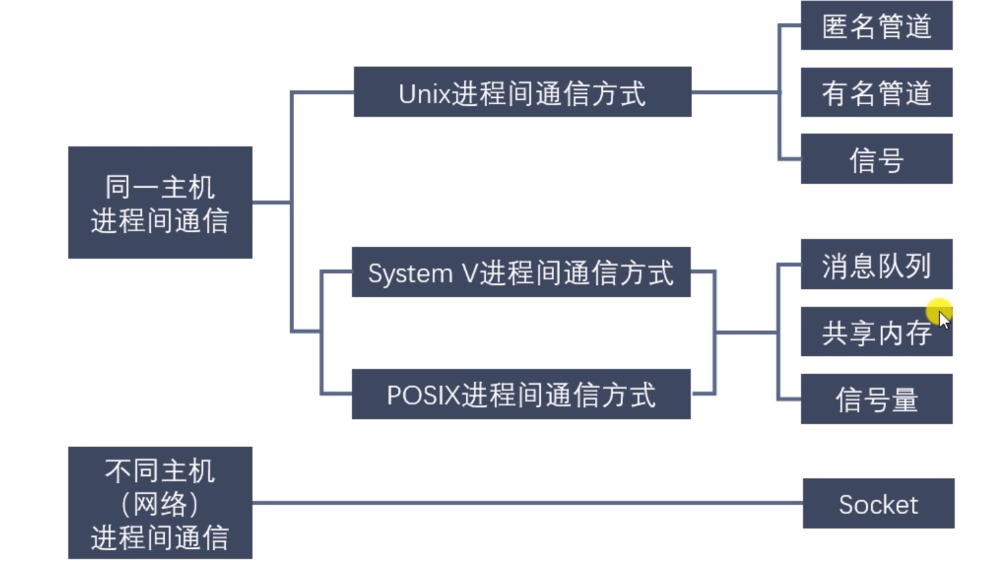

[ TOC ]
# wait 与 waitpid 


## waitpid()
```c
pid_t waitpid(pid_t pid, int *wstatus, int options);
```
- 功能：回收指定进程号的子进程，可以设置是否阻塞。
- 参数：
    - pid：
	    - pid > 0 : 某个子进程的pid
	    - pid = 0 : 回收当前进程组的所有子进程
	    - pid = -1  : 回收所有的子进程，相当于wait()
	    - pid < -1 : 某个进程组的组id的绝对值，回收指定进程组中的子进程
    - options:
	    - 0 : 阻塞
	    - WNOHANG : 非阻塞
    - 返回:
	    - \> 0 : 返回子进程的id
	    - = 0 : options = WNOHANG, 表示还有子进程
	    - = -1 : 错误，或者没有子进程了

## 退出相关宏函数
- WIFEXITED(status) 非0，进程正常退出
- WEXITSTATUS(status) 如果上宏为真，获取进程退出的状态（exit的参数）
- WIFSIGNALED(status) 非0，进程异常终止
- WTERMSIG(status) 如果上宏为真，获取使进程终止的信号编号
- WIFSTOPPED(status) 非0,进程处于暂停状态
- WSTOPSIG(status) 如果上宏为真，获取是进程暂停的信号的编号
- WIFCONTINUED(status) 非0,进程暂停后已经继续运行


# 进程间通信
- 进程是一个独立的资源分配单元，不同进程之间的资源是独立的，没有关联，不能在一个进程中直接访问另一个进程的资源。
- 但是，进程不是孤立的，不同进程需要进行信息的交互和状态的传递，因此需要进程间通信（IPC：Inter Processes Communication）
- 进程间通信的目的：
    - 数据传输：一个进程需要将他的数据发送给另一个进程。
    - 通知事件：一个进程需要想另一个或一组进程发送消息，通知他们发生了某种事件。
    - 资源共享：多个进程之间共享同样的资源。所以内核提供互斥和同步机制。
    

 


 ## 匿名管道
 统计一个目录中文件的数目命令：
 ```shell 
 ls | wc -l 
 ```
 ， 为了执行该命令，shell创建了两个进程来分别执行ls和wc

 
### 特点
- 管道其实是一个内核内存中维护的缓冲器，不同操作系统大小不一定相同。
- 管道拥有文件的特质：读操作、写操作，匿名管道没有文件实体，有名管道有文件实体，但不存储数据。可以按照操作文件的方式对管道进行操作。
- 一个管道是一个字节流，使用管道时不存在消息或者消息边界的概念，从管道读取数据的进程可以读取任意大小的数据快，而不管写入进程写入管道的数据块的大小是多少。
- 通过管道传递的数据是顺序的，从管道中读取出来的字节的顺序和他们被写入管道的顺序是完全一样的。
- 在管道中的数据传递方向是单向的，一端写入一段读取，半双工。
- 从管道读取数据是一次性操作，管道中无法使用lseek()来随机访问内存。
- 匿名管道只能在具有公共祖先的进程之间使用。


### pipe()
```c
#include <unistd.h>
int pipe(int pipefd[2]);
```
- 功能：创建一个匿名管道，用来进行进程通信。
- 参数：
    - pipefd[2] 这个数组是一个传出参数
    - pipefd[0] 读端
    - pipefd[1] 写端
- 返回值：
    0：成功
    -1：失败

- 注：
管道默认阻塞，read阻塞，如果管道满了，write阻塞

### fpathconf()
```c
 #include <unistd.h>
long fpathconf(int fd, int name);
```
- 功能：获取系统配置的值

char * buf[]
- memset(buf, 0, sizeof(buf))、bzero()清空buf

## 有名管道
### FIFO与pipe区别
1. FIFO在文件中作为一个特殊文件存在，但FIFO中的内容却存放在内存中
2. 当使用FIFO的进程退出后，FIFO文件将继续保存在文件系统中以便以后使用
3. FIFO有名字，不相关进程可以通信

## 内存映射
### mmap、munmap
```c
#include <sys/mman.h>

void *mmap(void *addr, size_t length, int prot, int flags, int fd, off_t offset);
/*
    - 功能：将一个文件或者设备的数据映射到内存中
    - 参数：
	- void *addr : NULL,由内核指定
	- length : 要映射的内存的长度，这个不能为0,建议使用文件长度
	    获取文件的长度 : stat lseek
	- prot 
	    PROT_EXEC  Pages may be executed.
       	    PROT_READ  Pages may be read.
       	    PROT_WRITE Pages may be written.
       	    PROT_NONE  Pages may not be accessed.
	- flags 
	    MAP_SHARED
            Share this mapping.  Updates to the mapping are visible to other processes mapping the same region, and (in the case of file-backed mappings) are carried through to the  undelying file.    
	    MAP_PRIVATE
            Create  a  private  copy-on-write mapping.  Updates to the mapping are not visible to other processes mapping the same file, and are not carried through to the underlying file It is unspecified whether changes made to the file after the mmap() call are visible in the mapped region.

	- offset : 偏移量,4k整数倍，0不偏移
*/

int munmap(void *addr, size_t length);
/*
    - 功能: 释放内存映射
    - 参数：
	- addr : 要释放的内存的首地址
	- length : 要释放内存的大小，要和mmap函数中的length参数一样
*/
```

## 计时器
### settimer

```c
    #include <sys/time.h>
    int setitimer(int which, const struct itimerval *new_value,struct itimerval *old_value);

    - 功能：设置定时器。可以代替alarm函数，精度us
    - 参数：
	-which：定时器以什么时间计时
	    ITIMER_REAL：真实时间，时间到达，发送SIGALRM 常用
	    ITIMER_VIRTUAL：用户时间，时间到达，发送SIGVTALRM
	    ITIMER_PRO：以该进程在用户态和内核态下所消耗的时间计算，时间到达，发送SIGPROF
	-mew_value：设置定时器属性
	-old_value：记录上一次的时间参数，一般不是用，默认NULL
    - 返回值：
	0：成功
	1：失败

```
## 共享内存
### 共享内存与内存映射的比较
1. 共享内存可以直接创建，内存映射需要磁盘文件（匿名映射除外）
2. 共享内存效果更高
3. 内存
    - 所有的进程操作的是同一块共享内存
    - 内存映射，每一个进程在自己的虚拟地址空间中有一个独立的内存

4. 数据安全
    - 进程突然推出
	共享内存还存在
	内存映射区消失
    - 运行进程的电脑宕机
	数据内存在共享内存中没有了
	内存映射区在磁盘中还存在
5. 生命周期
    - 内存映射区：进程退出，内存映射区销毁
    - 共享内存：进程退出，共享内存还在，需要手动删除或关机      
	如果进程推出，会自动和共享内存进行取消关联

## 守护进程
### 创建步骤
1. 执行一个fork()，之后父进程退出，子进程继续执行。
2. 子进程调用setsid() 开启一个新会话
3. 清楚进程的umask确保守护进程拥有所需权限
4. 修改进程的当前工作目录，通常会改为根目录(/)。
5. 关闭守护进程从其父进程继承而来的所有打开着的文件描述符。
6. 在关闭文件描述符0、1、2之后，守护进程通常会打开/dev/null 并使用dup2()使所有描述符指向这个设备
7. 核心业务逻辑
